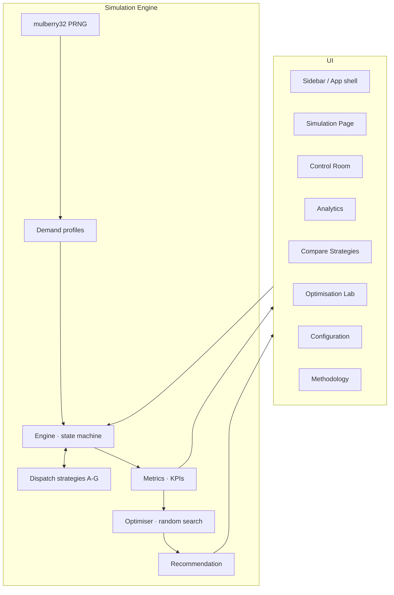

# LiftOpt — Intelligent Elevator Traffic Simulator

> **Simulate. Optimise. Move Smarter.**

LiftOpt is a browser-based operations-research and smart-building digital-twin experiment
for residential condominium elevator systems. It answers a single business question:

> *How can a condominium's lift system operate more efficiently, effectively, and
> optimally during peak and non-peak hours?*

The product ships a deterministic discrete-tick simulation engine, seven dispatch
strategies with a clean pluggable interface, live building visualisation, an
operations-centre dashboard, a compare-strategies benchmarking mode, an optimisation
lab, and a recommendation engine — all in a self-contained React app.

---

## Problem statement

Floors follow common condo signage — `SB3, SB2, SB1, G, 1, 2, … n` — and every
dimension (basement count, above-ground floors, units per floor, residents per unit)
is user-configurable. The engine's arrival rate scales linearly with the building's
population, so a 20-floor block gets proportionally less traffic than an 80-floor
tower without any manual tuning of the intensity slider.

A typical 44-storey condominium sees three very different traffic regimes:

- **Morning down-peak (07:00 – 09:00)** — residents leave residential floors, ~70% to
  the ground floor and ~25% to basement parking.
- **Evening up-peak (17:30 – 20:30)** — residents arrive from the lobby and basement
  and travel up to residential floors.
- **Non-peak / interfloor** — sparse random traffic including deliveries, facility
  visits, and short trips between residential floors.

The dispatch policy that minimises waiting time under one regime is often the *wrong*
policy under another. LiftOpt lets a building manager, an OR analyst, or an engineering
team quantify these trade-offs, benchmark alternatives on identical seeded demand, and
produce a defensible operational recommendation for each part of the day.

---

## Screenshots

_Placeholders — capture on the dev server._

- `docs/simulation.png` — live building visualisation and playback bar
- `docs/control-room.png` — ops centre dashboard
- `docs/compare.png` — strategy comparison table
- `docs/optimise.png` — optimisation lab progress
- `docs/methodology.png` — methodology page

---

## Key features

- **Deterministic simulation engine** — same `(config, seed)` → identical passenger
  demand and identical results, essential for fair benchmarking.
- **Seven dispatch strategies** — Nearest, Direction-Aware Collective, ETA, Load-Aware
  ETA, Soft Zoning, Peak-Hour Adaptive, and a fully-tunable Cost-Function Optimised
  strategy, all sharing a single `DispatchStrategy` interface.
- **Six traffic profiles** — Morning down-peak, Evening up-peak, Non-peak interfloor,
  Lunch delivery spike, Weekend bi-modal, Extreme congestion; plus a full custom mode
  with arrival-rate and OD-bias controls.
- **Live building visualisation** — vertical shaft view with real-time elevator cars,
  direction, load, waiting queues per floor, hall-call chips.
- **Operations Control Room dashboard** — 18 live KPIs including P90/P95 waiting time,
  utilisation, max queue, floors travelled, door cycles, energy proxy.
- **Analytics** — waiting-time trend, waiting-time distribution, per-elevator
  utilisation, per-floor queue length, elevator movement timeline, origin→destination
  heatmap.
- **Compare Strategies mode** — runs every selected strategy against exactly the same
  seeded demand and highlights the best overall, best P95, best queue, best energy.
- **Optimisation Lab** — random search over cost-function weights, evaluated across a
  configurable seed sweep, minimising a normalised objective.
- **Recommendation engine** — synthesises simulation output into a per-mode operational
  plan (dispatch mode, initial positions, operational logic, expected impact vs the
  Nearest baseline).
- **CSV export** — passenger-level, elevator-level, and strategy-comparison CSVs.
- **Methodology page** — full transparency on models, assumptions, and formulas.

---

## Simulation methodology (short form)

- Deterministic simulation with fine-tick advance (`Δt = 0.5 s`), event-driven feel:
  hall calls dispatch instantly on arrival; elevator state transitions fire when
  per-state timers elapse.
- Elevator state machine:
  `IDLE ↔ MOVING_UP/DOWN → DOOR_OPENING → BOARDING → DOOR_CLOSING → …`
  with collective control (continue in current direction while stops remain, then
  reverse).
- Arrivals: non-homogeneous Poisson thinning per tick with a Bernoulli tail to
  preserve fractional expected arrivals.
- Reproducibility: `mulberry32` seeded PRNG shared by both the demand model and any
  strategy that needs randomness.
- Metrics: all values on every page come from `computeMetrics(state)` — no hardcoded
  numbers anywhere.

Full details, including all formulas, live in the in-app Methodology page.

---

## Passenger demand modelling

| Mode                | Arrival rate                                              | OD bias                                                   |
|---------------------|-----------------------------------------------------------|-----------------------------------------------------------|
| Morning down-peak   | Bell centred at ~⅓ of window, peak ~600/hr × intensity    | Origin residential, 70% GF · 25% basement · 5% interfloor |
| Evening up-peak     | Bell centred at ~½ of window, peak ~550/hr × intensity    | Origin 65% GF · 35% basement → residential                |
| Non-peak            | Flat ~90/hr × intensity                                   | Mixed down/up/interfloor/basement                         |
| Lunch spike         | Narrow bell + baseline 120/hr                             | Bias to GF                                                |
| Weekend             | Bi-modal (mid-morning + late-afternoon)                   | Heavier interfloor mix                                    |
| Extreme congestion  | Flat 1400/hr × intensity                                  | Mixed direction                                           |
| Custom              | User-configured constant / peak-window                    | User-configured origin & destination biases               |

---

## Dispatch algorithms

| Strategy                    | Idea                                                                 |
|-----------------------------|----------------------------------------------------------------------|
| Nearest Elevator            | Baseline — closest by floor distance                                 |
| Direction-Aware Collective  | Prefer en-route in same direction → idle → reverse                   |
| Estimated Time of Arrival   | Full projected pickup time factoring stops, doors, boarding          |
| Load-Aware ETA              | ETA + cubic capacity penalty + stop-queue congestion penalty         |
| Soft Zoning                 | Owning-zone bonus with overflow when the owner would be too slow     |
| Peak-Hour Adaptive          | Behaviour switch by traffic mode; also repositions idle cars         |
| Cost-Function Optimised     | Weighted sum: wait · detour · onboardDelay · capacityRisk · energy · cluster |

All strategies implement `DispatchStrategy.assignCall(state, hallCall)` and are
registered at import time — adding a new one is a single file.

---

## Optimisation methodology

The Optimisation Lab runs **random search** over the cost-function weights,
evaluating each candidate on a user-configurable seed sweep and averaging. Candidates
are compared under a normalised objective:

```
objective = 0.4 · avgWait/60
          + 0.25 · P95Wait/180
          + 0.15 · journey/120
          + 0.10 · energyProxy/20000
          + 0.10 · maxQueue/30
```

Weights are user-configurable. The lab reports iteration count, current score, best
score, best weights, and improvement vs a Nearest baseline that shares the exact same
seed sweep.

Random search was chosen over grid or a Bayesian optimiser because (a) it scales
gracefully to higher-dimensional weight vectors, (b) it is simple to explain to a
non-technical stakeholder, and (c) it avoids the tuning surface of Bayesian priors
inside a browser build. Deterministic seeding of the sampler keeps the search itself
reproducible.

---

## Energy proxy

```
energyProxy = 1.0 · floorsTravelled
            + 2.5 · stops
            + 1.5 · doorCycles
            + 1.2 · emptyTravelFloors
```

This is a comparison metric, **not** a kilowatt-hour estimate. Actual electricity
consumption requires engineering specs (motor efficiency curves, regen behaviour,
counterweight profile) that LiftOpt intentionally does not model. Use it only for
relative comparison between strategies on the same configuration.

---

## Technical architecture



```
src/
├── App.tsx
├── main.tsx
├── types.ts
├── hooks/useSimulation.ts
├── components/
│   ├── BuildingView.tsx
│   ├── Charts.tsx
│   ├── ElevatorDetail.tsx
│   ├── KpiCards.tsx
│   ├── PlaybackBar.tsx
│   ├── RecommendationCard.tsx
│   └── Sidebar.tsx
├── pages/
│   ├── SimulationPage.tsx
│   ├── ControlRoom.tsx
│   ├── Analytics.tsx
│   ├── ComparePage.tsx
│   ├── OptimisationLab.tsx
│   ├── ConfigPage.tsx
│   └── MethodologyPage.tsx
├── simulation/
│   ├── defaults.ts
│   ├── demand.ts
│   ├── engine.ts
│   ├── optimiser.ts
│   ├── recommend.ts
│   ├── rng.ts
│   └── dispatch/
│       ├── index.ts       # DispatchStrategy interface + shared helpers
│       ├── all.ts         # registration
│       ├── nearest.ts
│       ├── directional.ts
│       ├── eta.ts
│       ├── loadAware.ts
│       ├── zoning.ts
│       ├── adaptive.ts
│       └── costFunction.ts
└── utils/
    ├── csv.ts
    └── format.ts

tests/
├── engine.test.ts        # invariants + reproducibility
└── dispatch.test.ts      # strategy registration + behaviour
```

The engine is completely decoupled from React — you can `new Engine(config)` in a
worker or a Node CLI and get identical results.

---

## Quick start — no npm required

Open `LiftOpt.html` in any modern browser (double-click, or drag it onto Chrome/Safari/Firefox/Edge). The whole app — engine, dispatch strategies, charts, everything — is inlined into that single ~620 KB file. No dev server, no install, no internet needed at runtime (Google Fonts will load if online but the app falls back to system fonts).

To regenerate it after editing source:

```bash
npm install         # once
npm run build:single
# → writes LiftOpt.html to the project root
```

## Full dev workflow

```bash
npm install
npm run dev       # dev server on http://localhost:5173
npm run build     # standard multi-file production build to dist/
npm run preview   # preview the built app
```

## Testing

```bash
npm test          # runs vitest once
npm run test:watch
```

The test suite validates: capacity is never exceeded, waits/journeys are
non-negative, elevators stay within building bounds, passengers reach their
destinations, the same seed produces the same demand across strategies, and every
registered strategy assigns valid elevator indices.

---

## Model assumptions

- Passengers do not switch elevators mid-journey.
- Elevator capacity is a hard cap; a full car does not detour.
- Hall calls do not currently support destination-dispatch keypads.
- Passenger walking/decision time is not modelled.
- Energy proxy is dimensionless (see above).
- No sabbath or freight modes.
- Boarding/alighting time scales linearly with passenger count.

---

## Limitations

LiftOpt is a decision-support tool. It does **not** control real elevator hardware.
Any real-world deployment of a dispatch strategy requires integration with — and
approval from — the elevator OEM, the building management, and the applicable
safety-certification bodies.

---

## Future roadmap

- Destination-dispatch (keypad) call model.
- Regenerative braking energy model tied to OEM specs.
- Bayesian / evolutionary optimiser as an alternative to random search.
- Per-strategy KPI drill-downs on the Compare page.
- Worker-based simulation offload for very large buildings (60+ floors, 8+ cars).
- Historical demand replay from CSV.

